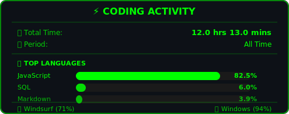

<!-- 🔥 LOGO ANIMADA COM EFEITO GLITCH -->
 

  
  <!-- 🖥️ HEADER TERMINAL STYLE COM CURSOR -->
  

    
  

  <!-- 🔥 CURRENT PROJECT -->

  

## 👨‍💻 About Me

🇧🇷 Brazilian developer passionate about building products that matter

🎯 Currently building **CINELOG** - A social network for movie enthusiasts

🤖 Obsessed with AI-assisted development (Windsurf + Claude)

🎬 Love cinema, especially European directors (Bergman, Haneke)

♟️ Chess player & astronomy enthusiast

📍 São Paulo →  🇸🇮 Soon Slovenia

## 🎵 Now Listening

<!-- Badge Follow Spotify -->

<!-- O que você já tem, mas pode testar outras tonalidades -->

## 🐍 Contribution Snake

## 🌐 Let's Connect

  

 

## 🛠️ **Stack Mestre**

  <!-- FRONTEND LEGENDÁRIO -->
  
<strong>📱 MOBILE MESTRE</strong>

  

    
    
    
    
    
  

 
<strong>🤖 IA CO-PILOTO</strong>

  
  
  

 
  <!-- BACKEND SÊNIOR -->
  
<strong>🔥 BACKEND ARQUITETO</strong>

  

    
    
    
  

  

## 📊 **System Metrics**

<table>
  <tr>
    <td>
      
    </td>
    <td>
      
    </td>
  </tr>
</table>

<!-- 📊 CONTRIBUTION GRAPH -->

