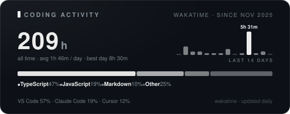

<!-- ╔══════════════════════════════════════════════════════════════╗ -->
<!-- ║  matheus@thepitch — profile README · boot sequence v2         ║ -->
<!-- ╚══════════════════════════════════════════════════════════════╝ -->

<div align="center">

<!-- 🖥️ HEADER · TYPING TERMINAL -->


<!-- 🔩 STATUS ROW -->
<p>
  
  
  
</p>

</div>

## `$ whoami`

<!-- 🧬 NEOFETCH · logo à esquerda, specs à direita -->
<table>
<tr>
<td valign="top">
<pre>
 ┌────────────────────┐
 │  ●  ●  ●    ~/dev   │
 ├────────────────────┤
 │  >_ booting...      │
 │  ▓▓▓▓▓▓▓▓▓▓▓░░  87% │
 │  >_ the_pitch up    │
 │  >_ ready_          │
 └────────────────────┘
</pre>
</td>
<td valign="top">
<pre>
matheus@thepitch
────────────────────────────────
 os        The Pitch · iOS + Android
 kernel    React Native 0.83 · Expo 55
 uptime    shipping since 2019
 shell     TypeScript 5.9
 backend   Supabase · PostgreSQL · Node
 ai        Cursor + Claude — AI-native
 locale    Sao Paulo  ->  Slovenia
 daemons   cinema.d · chess.d · astro.d
</pre>
</td>
</tr>
</table>

## `$ cat about.txt`

```log
[ok]  brazilian dev building products that actually matter
[run] The Pitch — stadium check-in for football fans (live on both stores)
[bg]  cinema.d      → european directors on loop (Bergman, Haneke)
[bg]  chess.d       → long games, patient plans
[bg]  astro.d       → looking up when the screen goes dark
[net] Sao Paulo 🇧🇷 → Slovenia 🇸🇮 — do Brasil para o mundo
```

## `$ ./the-pitch --launch`

<div align="center">


<br /><br />

[](https://apps.apple.com/app/id6759470434)
&nbsp;
[](https://play.google.com/store/apps/details?id=com.matheusdev.thepitch)

<br />

> 🏟️ **Stadium check-in for Brazilian football fans** — GPS-verified presence, live match data, predictions & a social feed of who's at the game.

</div>

## `$ spotify --now-playing`

<div align="center">

[](https://open.spotify.com/user/matheusmouramartinho)

[](https://open.spotify.com/user/matheusmouramartinho)

</div>

## `$ git contrib --animate`

<div align="center">


</div>

## `$ cat stack.lock`

<div align="center">

<strong>📱 MOBILE MESTRE</strong><br />


<br /><br />

<strong>🤖 IA CO-PILOTO</strong><br />


<br /><br />

<strong>🔥 BACKEND ARQUITETO</strong><br />


</div>

## `$ uptime --stats`

<div align="center">

<table>
  <tr>
    <td>
      
    </td>
    <td>
      
    </td>
  </tr>
</table>


</div>

## `$ ping matheus`

<div align="center">

[](https://linkedin.com/in/matheus-moura-martinho-8630091b3)
[](https://instagram.com/matmoura)
[](https://matheusmartinho.dev)
[](mailto:matmouramartinho@gmail.com)

</div>

---

<div align="center">


<sub>cinema · chess · astronomy keep the code human · 🇧🇷 → 🌍</sub>

</div>
