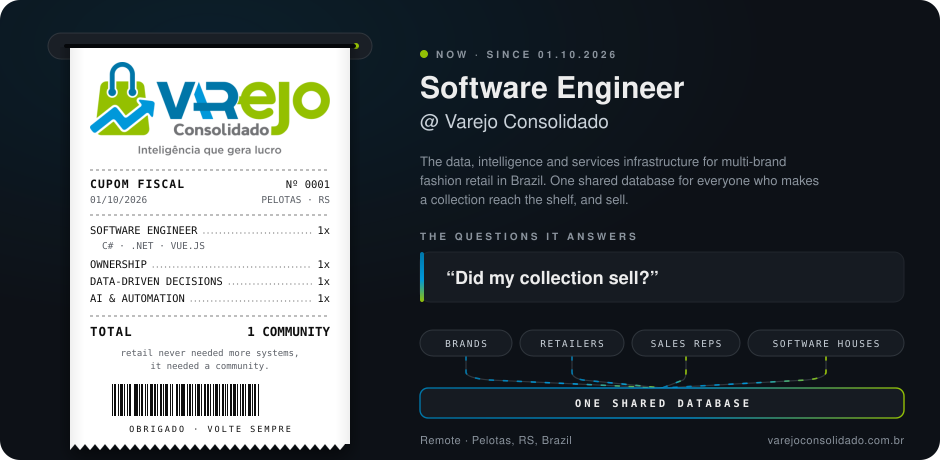
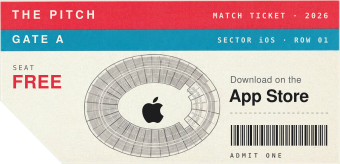
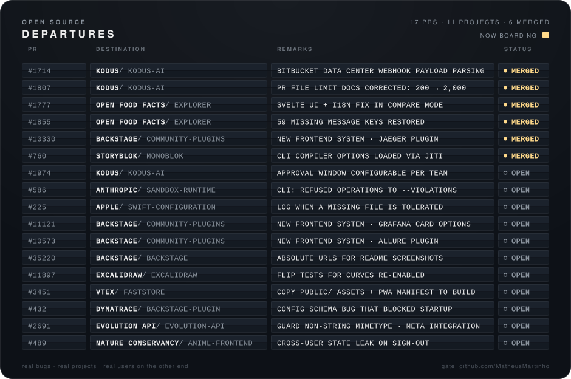
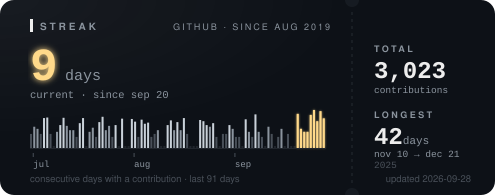
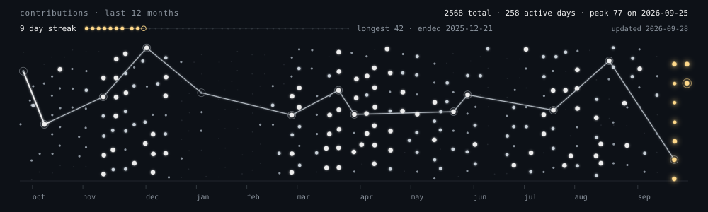
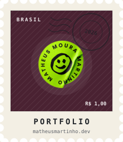

 

# Matheus Martinho

**Software Engineer at Varejo Consolidado. I build products end-to-end, and fast.**

<code>-23.5936, -46.7239</code> &nbsp;→&nbsp; <code>48.2082, 16.3738</code>
 
São Paulo, Brazil &nbsp;·&nbsp; destination: Vienna

 
 

&nbsp;

 

---

 

## 01 — Who

Developer from Brazil. I started in Computer Science back home and finished
my studies in Vancouver, on the web development side. I've kept learning by
shipping ever since. I design, code, and launch the whole thing: from database
schema to App Store screenshot.

I work with AI the way a pilot works with instruments: I make the calls, it
handles the throughput. That workflow let me build and launch a full social
app solo in months, not years.

When I'm not shipping: chess, astronomy, wildlife photography, and long runs
around São Paulo.

 

## 02 — Varejo Consolidado

Since October 2026 I'm a Software Engineer at **Varejo Consolidado**, the data,
intelligence and services infrastructure for multi-brand fashion retail in Brazil.
Brands, retailers, sales reps and software houses on one shared database, built on
an idea I fully stand behind: fashion retail never needed more systems, it needed
a community.

 

 

## 03 — The Pitch

My side project. **Stadium check-in for Brazilian football fans** — GPS-verified
presence, live match data, predictions, rankings, and a social feed of who's
actually at the game. Launched during the 2026 World Cup window. Live on both stores.

 

&nbsp;&nbsp;

 
 

 

<b>Under the hood</b> — for the technically curious

 

- **Geofenced check-ins** — GPS verification against real stadium perimeters, built to resist spoofing
- **Real-time everything** — live match data, standings and rankings streaming through Supabase Realtime
- **Prediction engine** — pre-match predictions with a points economy and leaderboards
- **Social layer** — feed of verified attendees, per-stadium and per-club communities
- **Solo infrastructure** — RLS security model, connection pooling, image CDN, OTA updates via EAS, full observability with Sentry + PostHog

 

## 04 — Stack

 

 

## 05 — Now

what's actually on my desk this month

- Ramping up at Varejo Consolidado on C#, .NET and Vue.js
- Hardening The Pitch — security audit, geofence precision, performance under load
- Studying German. It's going. Slowly, but it's going.
- Trying to break my 5K record before the year ends

 

## 06 — Open Source

 

<b>Every PR, with links</b>

 

**Merged**

- **Kodus** `kodus-ai` — fixed Bitbucket Data Center webhook payload parsing · [#1714](https://github.com/kodustech/kodus-ai/pull/1714) · 
- **Kodus** `kodus-ai` — corrected the documented PR file limit from 200 to 2,000 · [#1807](https://github.com/kodustech/kodus-ai/pull/1807) · 
- **Open Food Facts** `explorer` — Svelte UI + i18n fix in compare mode · [#1777](https://github.com/openfoodfacts/openfoodfacts-explorer/pull/1777) · 
- **Open Food Facts** `explorer` — restored 59 message keys used in code but missing from `en.json` · [#1855](https://github.com/openfoodfacts/openfoodfacts-explorer/pull/1855) · 
- **Backstage** `community-plugins` — New Frontend System support for the Jaeger plugin · [#10330](https://github.com/backstage/community-plugins/pull/10330) · 
- **Storyblok** `monoblok` — CLI fix: TypeScript/JSON compiler-options loading via jiti · [#760](https://github.com/storyblok/monoblok/pull/760) · 

**Open**

- **Kodus** `kodus-ai` — made the approval cron's lookback window configurable per team, bounded at ten years · [#1974](https://github.com/kodustech/kodus-ai/pull/1974) · 
- **Anthropic** `sandbox-runtime` — CLI writes refused operations to `--violations` and starts the filesystem monitor that sees them · [#586](https://github.com/anthropics/sandbox-runtime/pull/586) · 
- **Apple** `swift-configuration` — log when a file-based provider tolerates a missing file (draft, proposing the API shape) · [#225](https://github.com/apple/swift-configuration/pull/225) · 
- **Backstage** `community-plugins` — Grafana card table options exposed as extension config in the New Frontend System · [#11121](https://github.com/backstage/community-plugins/pull/11121) · 
- **Backstage** `community-plugins` — New Frontend System support for the Allure plugin · [#10573](https://github.com/backstage/community-plugins/pull/10573) · 
- **Backstage** `backstage` — absolute URLs for README screenshots so they render off-repo · [#35220](https://github.com/backstage/backstage/pull/35220) · 
- **Excalidraw** `excalidraw` — re-enabled flip tests for curves outside min/max points · [#11897](https://github.com/excalidraw/excalidraw/pull/11897) · 
- **VTEX** `faststore` — copy image and PWA manifest assets from public/ to build · [#3451](https://github.com/vtex/faststore/pull/3451) · 
- **Dynatrace** `backstage-plugin` — fixed a config schema bug that blocked app startup, with regression tests · [#432](https://github.com/Dynatrace/backstage-plugin/pull/432) · 
- **Evolution API** — guard non-string mimetype before image check in Meta integration · [#2691](https://github.com/evolution-foundation/evolution-api/pull/2691) · 
- **The Nature Conservancy** `animl-frontend` — fixed a cross-user state leak on sign-out in a wildlife camera-trap platform · [#489](https://github.com/tnc-ca-geo/animl-frontend/pull/489) · 
- **Storyblok** `monoblok` — CLI fix: `create` no longer splits project paths that contain spaces · [#844](https://github.com/storyblok/monoblok/pull/844) · 
- **Storyblok** `monoblok` — CLI fix: `components push` sends the component preview image again · [#845](https://github.com/storyblok/monoblok/pull/845) · 

 

 

## 07 — Activity

 

 
 

 

 

## 08 — Listening

 

 

## 09 — Contact

 

&nbsp;

&nbsp;

&nbsp;

 
 

<code>♞ f3</code> &nbsp;·&nbsp; built solo · shipped fast · still going

